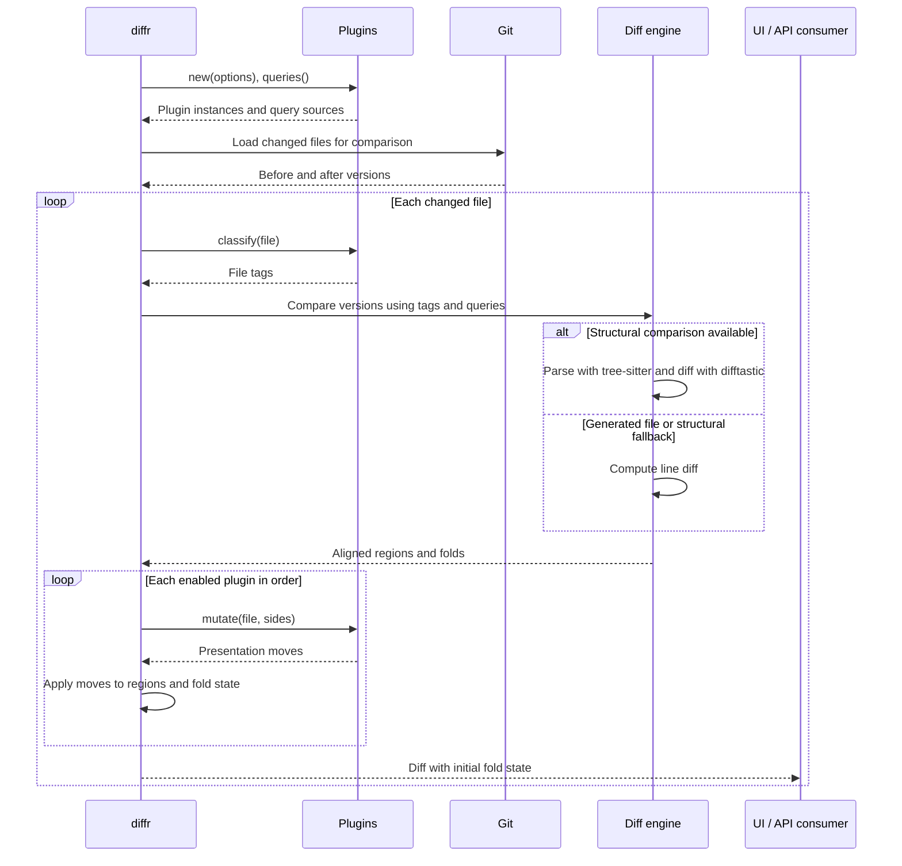

# Plugin Architecture

`diffr` has a powerful, wasm-based plugin API which customizes how it presents changed files. For more details, read the [docs](./docs/plugin.md).

For example, the following are all implemented as plugins:

- Context Folding: showing relevant context, like a function signature + closing brace (if applicable)
- Algorithm Summarization: using an LLM to summarize long algorithms into pseudocode
- Comment collapsing: collapsing long LLM comments + function bodies & expanding both at once
- Collapsing tests by default

## Architecture

When you run `diffr ${commit_range_exp}`, the following happens:

1. Commits loaded from git
2. Plugins (explained in more detail later) load
3. Each file is parsed via tree-sitter & diffed using difftastic's ast/ast diffing algorithm
  - This produces an alignment of file / file
  - Note: because of known upstream limitations, the diffing algorithm is quite CPU/Mem intensive.
    We fall back to a textual diffing algorithm in case of issue
4. Plugins define which AST nodes are present in the API + folded by default.

## Plugin Interface

The [Rust SDK's `Plugin` trait](../crates/diffr-plugin-sdk/src/lib.rs) exposes
four important methods:

```rust
// rust bindings of underlying WASM plugin API
use diffr_plugin_sdk::{FileEntry, Move, Pairing, QuerySource, Source};

pub trait Plugin: Sized {
    /// Options are configuration for the plugin
    type Options: serde::de::DeserializeOwned;

    /// new loads the plugin from its configuration; this is to allow plugins to fail
    /// early if user config isn't set correctly
    fn new(options: Self::Options) -> anyhow::Result<Self>;

    /// queries return tree-sitter queries to add metadata to the tree-sitter tree
    /// this means that the plugins can backpack off of the tree-sitter parse that the
    /// diffing algorithm does.
    fn queries(&self) -> anyhow::Result<Vec<QuerySource>>;

    /// classify (bad name lol) runs classification of files into generated, test, etc.
    /// Useful to prevent wasteful semantic diffing for things users will skip.
    /// emits tags that clients can make use of
    fn classify(&self, file: &FileEntry) -> anyhow::Result<Vec<String>>;

    /// mutate emits a series of structured mutations ('Moves') to the parsed diff type
    /// (e.g., fold X function body, show Y lines of context around it, etc.)
    fn mutate(&self, file: &FileEntry, sides: &Pairing<Source>)
        -> anyhow::Result<Vec<Move>>;
}
```

> Note: the api above is subject to change / unstable at the moment. It's a bit overengineered for our taste and we are working to simplify it. For example: there are too many methods on it, and the trait uses [anyhow](https://github.com/dtolnay/anyhow) and really should be using [thiserror](https://github.com/dtolnay/thiserror).



The WASM interface is defined in [`wit/plugin.wit`](../wit/plugin.wit).
The SDK's [`export!` macro](../crates/diffr-plugin-sdk/src/lib.rs) and
[guest adapter](../crates/diffr-plugin-sdk/src/guest.rs) expose a Rust plugin
as a WASM component; the [Wasmtime runner](../src/plugin/wasm.rs) loads and
calls it. See the [context plugin](../plugins/context/src/lib.rs) and its
[Rust query](../plugins/context/queries/rust.scm) for a concrete implementation.